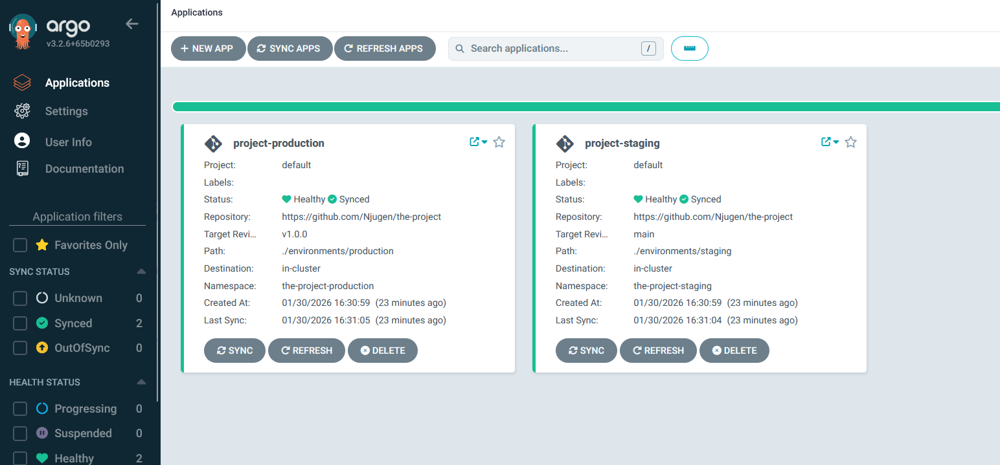
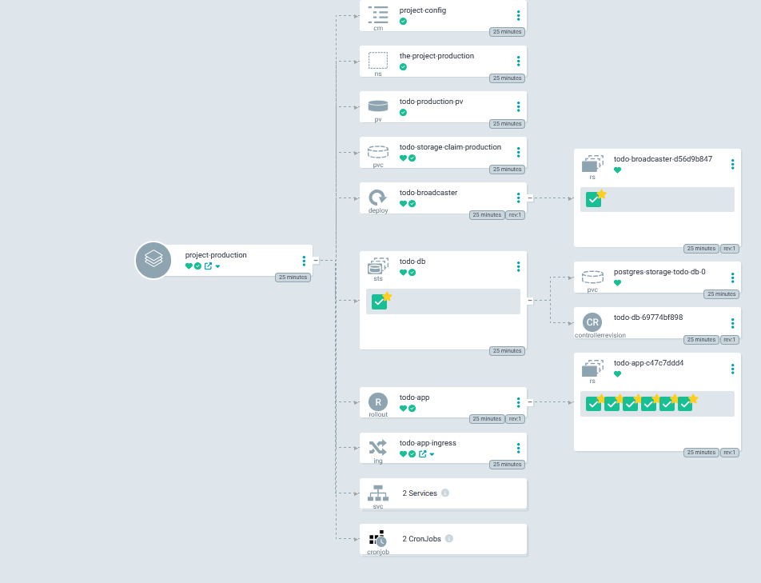
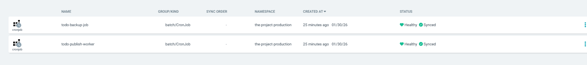
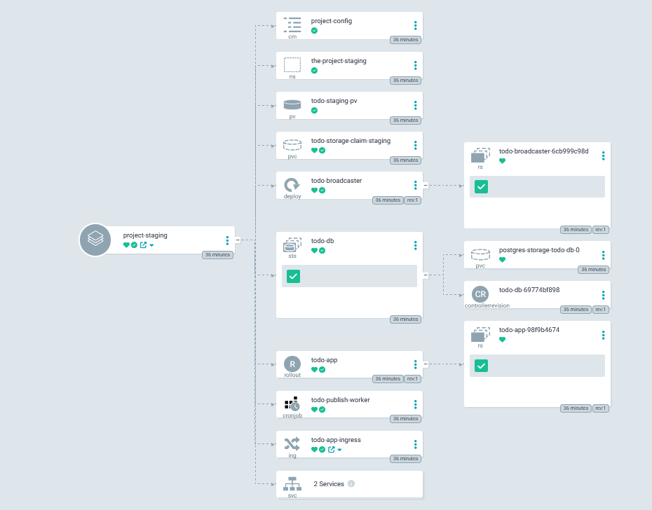
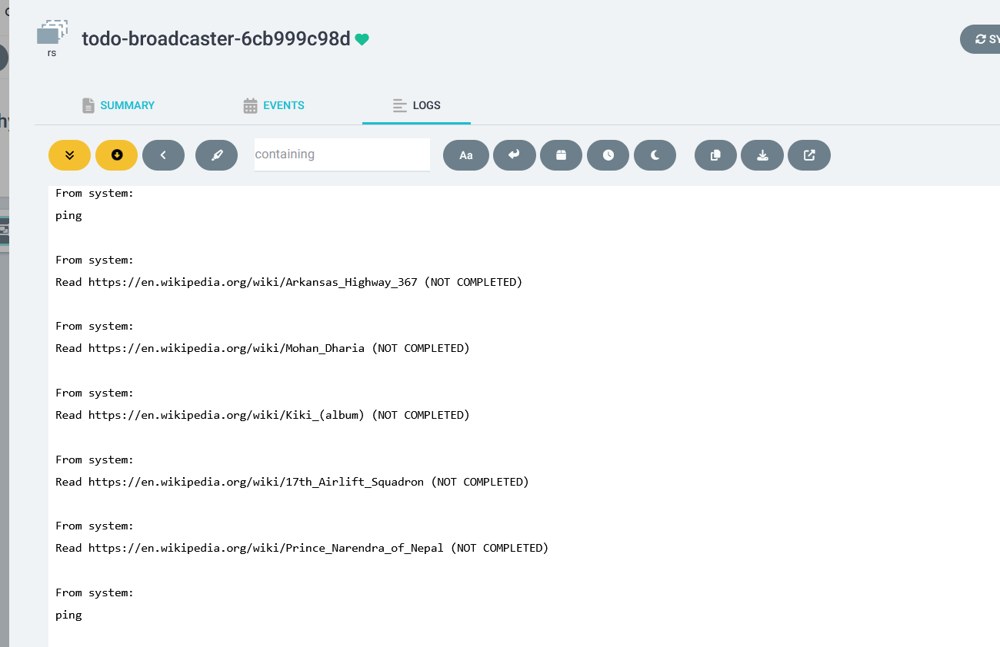

There are now two separate namepaces:
- the-project-staging
- the-project-production

Both fulfills the assignment requirements, by using the ``/manifests`` folder and its kustomization as a base.
Each namespace have their own manifests located in ``/environments/staging`` and ``environments/production``, which
use the base manifests plus additional manifests for respective requirements. Each environment also
patches (replace specific settings) existing manifests to satisfy the requirements.

The persistent volumes and volumes claims are special cases that cannot be easily patched (as Argo does not permit this), which means they have been removed from the base - and are created separately for each namespace.

Earlier in the course, there were no assignments in which to create a database backup job - so this has been done in this assignment (Github Action pipline has been modified for this). The backup process runs as a cronjob periodically in production, while it does not even exist at all in staging. The production namespace sends the TODO item to third party REST API (https://mockapi.io/projects/69763b0fc0c36a2a99509328, as previously), while the staging just prints them out in the console using ```console.log``

## Try this out

Launch Argo (at localhost:8080) in its own namespace, and go to the project folder. Run this:

```
kubectl apply -f application.yaml -n argocd
```

After a while, the results should look like this:



## Production

Slightly more replicas, and a backup job




## Staging

No backup worker. Less replicas



Messages written to console instead of sent to third party API:


## Argo

Argo and sync settings can be found in ./application.yaml

## Misc

Both namespaces automatically add TODO items in interval, like previously. Argo syncs the staging namespace
when a commit has been pushed to the ``main`` branch

```
git push origin main
```

The production gets synced when a commit has been pushed to a tag v1.0.0 (wildcards would be nice, but Argo does not permit this)

```
git tag -f v1.0.0
git push origin v1.0.0
```

You may make some changes and/or make new commits and pushes to observe.