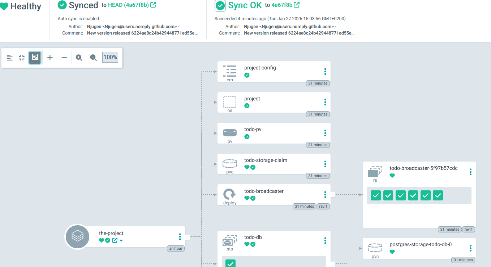
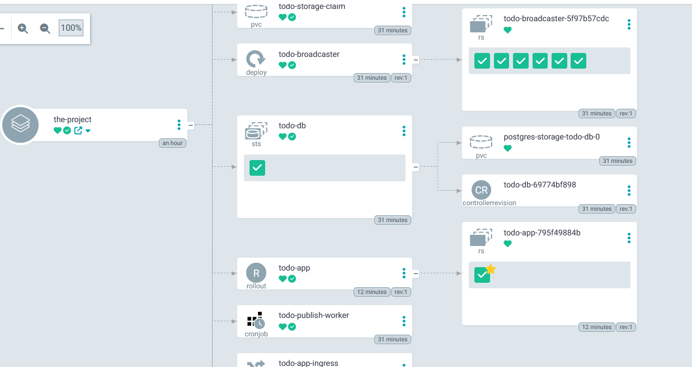

You may try this repo out in your ArgoCD yourself, or just use 
```
kubectl apply -k .
kubectl port-forward <TODO-APP POD NAME> 3003:3000
```

Please note! You need NATS up and running locally in order for this app to sync and work properly! NATS itself is not handled by GitOps!
(NATS_URL: "nats://my-nats.default.svc.cluster.local:4222")




